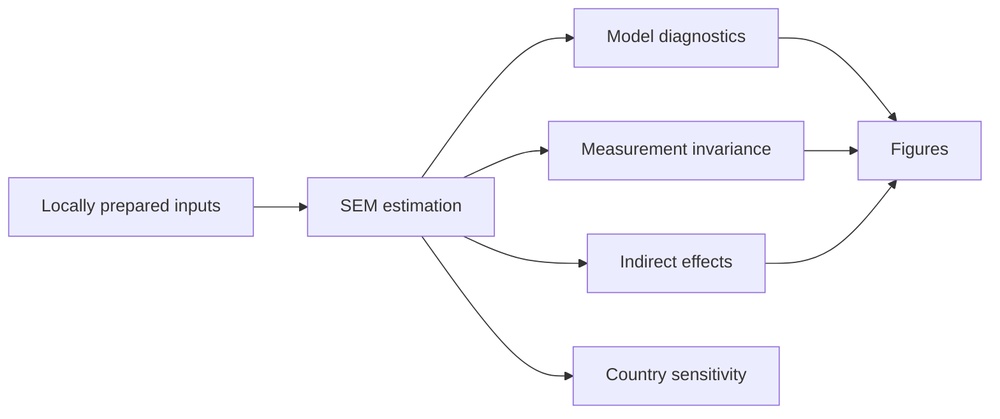

# Structural Equation Modeling | Reproducible Analysis

**R-based statistical analysis and Python visualization in a documented computational workflow for structural equation modeling, model evaluation, and robustness analyses.**

   

## Overview

This repository provides analysis scripts for a research workflow examining associations among body mass index categories, multidimensional intermediate constructs, and cognitive outcomes using structural equation modeling (SEM). The code includes measurement invariance assessment, indirect effects, and leave-one-country-out sensitivity analysis.

## Code and aggregated results availability

This repository provides R and Python notebooks supporting the structural equation modeling analyses of the REDLINC XII study, together with selected aggregate statistical outputs.

The `outputs/` directory contains four summary tables of overall model fit and measurement invariance. These tables contain model-level statistics, not participant-level observations or source datasets.

The measurement invariance results have been cross-checked against the corresponding values reported in the associated manuscript, allowing for rounding. Other analytical outputs and complete end-to-end reproducibility remain subject to further verification. Public dissemination of unpublished results requires authorization from the responsible research team; this repository does not itself document that authorization.

Individual-level study data are not publicly distributed because of ethical, privacy, and data-sharing restrictions.

## Analysis workflow

## Notebooks

The statistical notebooks use **R (IRkernel)**; the figure notebook uses **Python 3**. Notebook cell outputs have been cleared for this public-facing version.

## Repository map

| Location | Purpose |
| --- | --- |
| `notebooks/01_Main_SEM_Analysis.ipynb` | Primary SEM, parameter estimates, model fit, and invariance testing |
| `notebooks/02_Country_Sensitivity_LOCO.ipynb` | Leave-one-country-out sensitivity analysis |
| `notebooks/03_Figure_Generation.ipynb` | Figure generation from locally generated summary outputs |
| `outputs/` | Selected aggregate model-fit and measurement-invariance tables |
| `docs/methodology.md` | Analytical approach and interpretation |
| `docs/reproducibility.md` | Setup, execution, and release limitations |
| `docs/security.md` | Public-release safeguards |

## Quick start

1. Install R and the packages in `R-packages.txt`; register the R kernel with Jupyter using `IRkernel::installspec()`.
2. For Python visualization, install the packages in `requirements.txt`.
3. Run the primary notebook in an appropriately configured local environment. Required inputs must be prepared separately and are not distributed here.
4. Run the country-sensitivity notebook if the locally prepared input supports this analysis.
5. Generate figures only after the required summary outputs are available locally. The four public CSV files are not sufficient to run the figure notebook as currently written.

## Methods and reproducibility

See [Methodology](docs/methodology.md) and [Reproducibility](docs/reproducibility.md). Selected aggregate results should be interpreted alongside the associated manuscript. They do not constitute a complete numerical reproduction package.

